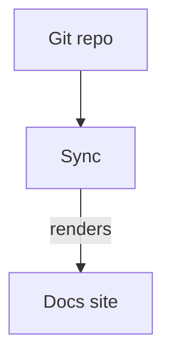

# Components

Every component below resolves to a real, styled component. **Anything not on this list
degrades to its children** — it renders as plain content rather than breaking the page, which is
why a misspelled component name shows up as unstyled text instead of an error.

Nothing is imported. Components are in scope on every page.

## The full set at a glance

| Component | For |
| --- | --- |
| `<Note>` `<Tip>` `<Info>` `<Warning>` `<Check>` `<Danger>` | Callouts, by severity |
| `<Callout icon color>` | A callout with your own icon and color |
| `<Banner type dismissible>` | A prominent announcement bar |
| `<Card>` `<CardGroup>` `<Columns>` | Linkable cards in a responsive grid |
| `<Tile>` | A card that leads with a preview image |
| `<Steps>` `<Step>` | Numbered instructions |
| `<Tabs>` `<Tab>` | Switchable views of the same idea |
| `<CodeGroup>` | Several code blocks as one tabbed panel |
| `<Accordion>` `<AccordionGroup>` | Progressive disclosure |
| `<Expandable>` | Nested detail, usually object shapes |
| `<Frame>` | A bordered, captioned container for an image |
| `<Badge>` | Inline status labels |
| `<Icon>` | An inline icon |
| `<Tooltip>` | A definition on hover or focus |
| `<Tree>` / `<FileTree>` + `<Tree.Folder>` `<Tree.File>` | File and folder structures |
| `<Color>` + `<Color.Item>` `<Color.Row>` | Color swatches, optionally per theme |
| `<Update>` | A changelog entry with a linkable anchor |
| `<Prompt>` | A copyable AI prompt |
| `<GitHub.Repo>` | A repository card with live stars and forks |
| `<Visibility for>` | Content for humans or for AI agents |
| `<View>` | A labelled variant of the same content |
| `<ParamField>` `<ResponseField>` | API parameter and response definitions |
| `<RequestExample>` `<ResponseExample>` `<Panel>` | Supplementary panels |
| ` ```mermaid ` | Diagrams |

There is **no video component** — see [Video and embeds](#video-and-embeds).

## Callouts

Six variants, each signalling a different intent. All take children only.

```mdx
<Note>Supplementary information, safe to skip.</Note>
<Info>Helpful context such as permissions or prerequisites.</Info>
<Tip>A recommendation or shortcut.</Tip>
<Warning>Something that can bite you; read before proceeding.</Warning>
<Check>Success confirmation or completed status.</Check>
<Danger>Critical warning about data loss or a breaking change.</Danger>
```

`<Callout>` is the same panel with your own icon and color:

```mdx
<Callout icon="sparkles" color="#7C3AED">
  A callout styled however you need it.
</Callout>
```

| Prop | Type | Default | Description |
| --- | --- | --- | --- |
| `icon` | `string` | — | A Lucide icon name. |
| `color` | `string` | — | Any CSS color, used for the icon and accent. |

## Banner

A prominent announcement bar. Inline on one page as a component, or site-wide via the
`banner` key in `docs.json` (see `configuration.md`) — both render the same thing.

```mdx
<Banner type="warning" dismissible>
  This page documents a beta API.
</Banner>
```

| Prop | Type | Default | Description |
| --- | --- | --- | --- |
| `type` | `string` | `info` | `info`, `warning`, or `critical`. |
| `dismissible` | `boolean` | `false` | Show a close button. |
| `content` | `ReactNode` | — | Alternative to children. |
| `color` | `string \| { light, dark }` | — | Override the background. |

Dismissal is not remembered between page loads.

## Cards and Columns

`<Card>` is a panel with an optional icon and title; giving it `href` makes the whole panel a
link. `<Columns>` arranges cards (or anything else) in a responsive grid. `<CardGroup>` is the
same component under its legacy name — both work.

```mdx
<Columns cols={2}>
  <Card title="Quickstart" icon="rocket" href="/quickstart">
    Get a site running in five minutes.
  </Card>
  <Card title="Components" icon="book" href="/components">
    Every component, with props.
  </Card>
</Columns>
```

| Prop | Type | Default | Description |
| --- | --- | --- | --- |
| `title` | `string \| ReactNode` | — | Card heading. |
| `icon` | `string \| ReactNode` | — | Lucide name, or your own node. |
| `href` | `string` | — | Makes the whole card a link. |
| `cols` | `number` | `2` | On `<Columns>` / `<CardGroup>`: columns in the grid. |

`cols` applies from tablet width up. **Phone width is always a single column**, however many
you ask for — two 150px cards break headings mid-word.

## Tile

A card that leads with a preview image. Put the image in the children; the title and
description render below it.

```mdx
<Tile title="Dashboard" description="Where a site's activity lives" href="/dashboard">
  
</Tile>
```

| Prop | Type | Default | Description |
| --- | --- | --- | --- |
| `title` | `string` | — | Tile heading. |
| `description` | `string` | — | Supporting line under the title. |
| `href` | `string` | — | Makes the whole tile a link. |

## Steps

A numbered walkthrough with automatic numbering and a connecting rail. Use it for setup guides
and ordered procedures.

```mdx
<Steps>
  <Step title="Connect a repo">
    Point Papervine at a Git repo of MDX + `docs.json`.
  </Step>
  <Step title="Sync">
    Papervine copies the repo into storage.
  </Step>
  <Step title="Render">
    Your docs site is live.
  </Step>
</Steps>
```

| Prop | Type | Default | Description |
| --- | --- | --- | --- |
| `title` | `string \| ReactNode` | — | On `<Step>`: the step heading. |

## Tabs

Switch between alternative views without leaving the page — the same task in different
languages or on different platforms.

```mdx
<Tabs>
  <Tab title="npm">
    Install with `npm install`.
  </Tab>
  <Tab title="pnpm">
    Install with `pnpm add`.
  </Tab>
</Tabs>
```

| Prop | Type | Default | Description |
| --- | --- | --- | --- |
| `title` | `string` | — | On `<Tab>`: the tab label. |

`<Tab>` takes no `icon`.

## Code blocks

Every fenced block gets Shiki highlighting in a dual light/dark theme, generated when the docs
are built rather than in the reader's browser, plus a copy button that appears on hover and
stays visible on touch devices.

**Text after the language becomes the block's title**, shown in a header bar:

````mdx
```ts lib/greet.ts
export function greet(name: string) {
  return `Hello, ${name}`;
}
```
````

Line-highlight ranges (```` ```js {2,4-6} ````) are parsed as "not a title" and otherwise
ignored — the block renders no differently from a plain one.

## CodeGroup

Several code blocks as one tabbed widget, labelled by each block's **title**, falling back to
its language.

````mdx
<CodeGroup>

```bash Terminal
papervine dev ./docs
```

```js config.js
export default { theme: "mint" };
```

</CodeGroup>
````

Give every fence a title. Without one they fall back to the language name, so three `bash`
blocks in a group all read the same.

## Accordion

`<Accordion>` is one collapsible disclosure. `<AccordionGroup>` draws several as a single
bordered list divided by hairlines, so a related set reads as a set. Accordions start closed.

```mdx
<AccordionGroup>
  <Accordion title="What is collapsed by default?">
    Accordions start closed, keeping the page scannable.
  </Accordion>
  <Accordion title="When to group" defaultOpen>
    Use `<AccordionGroup>` for a related set, like a FAQ list.
  </Accordion>
</AccordionGroup>
```

| Prop | Type | Default | Description |
| --- | --- | --- | --- |
| `title` | `string \| ReactNode` | required | The clickable heading. |
| `defaultOpen` | `boolean` | `false` | Start expanded. |

## Expandable

Nested detail, most often the shape of an object inside a field definition.

```mdx
<ResponseField name="user" type="object">
  The authenticated user.

  <Expandable title="properties">
    <ResponseField name="id" type="string">The user's id.</ResponseField>
    <ResponseField name="email" type="string">The user's email.</ResponseField>
  </Expandable>
</ResponseField>
```

| Prop | Type | Default | Description |
| --- | --- | --- | --- |
| `title` | `string` | — | The disclosure label. |
| `defaultOpen` | `boolean` | `false` | Start expanded. |

## Frame

A bordered container with an optional caption, for presenting screenshots and diagrams
consistently.

```mdx
<Frame caption="The dashboard after a first sync">
  
</Frame>
```

| Prop | Type | Default | Description |
| --- | --- | --- | --- |
| `caption` | `string` | — | Caption shown under the frame. |

## Badge

An inline status label.

```mdx
<Badge color="green">Stable</Badge>
<Badge color="amber" shape="pill" icon="flask-conical">Beta</Badge>
<Badge stroke disabled>Deprecated</Badge>
```

| Prop | Type | Default | Description |
| --- | --- | --- | --- |
| `color` | `string` | `gray` | Any named color or CSS color. |
| `size` | `string` | `md` | `sm`, `md`, or `lg`. |
| `shape` | `"rounded" \| "pill"` | `rounded` | Corner style. |
| `icon` | `string` | — | A Lucide icon name shown before the label. |
| `stroke` | `boolean` | `false` | Outline instead of a filled background. |
| `disabled` | `boolean` | `false` | Muted styling. |

## Icon

```mdx
<Icon icon="rocket" size={20} color="#7C3AED" />
<Icon src="/images/custom-mark.svg" size={20} />
```

| Prop | Type | Default | Description |
| --- | --- | --- | --- |
| `icon` | `string` | — | A Lucide icon name. |
| `src` | `string` | — | A path or URL to an image, used instead of `icon`. |
| `size` | `number` | — | Pixel size. |
| `color` | `string` | — | Any CSS color. |

**Papervine resolves Lucide names only** — not Font Awesome, not Tabler. An unknown name
renders nothing rather than breaking the line, and `src` is the escape hatch for any icon that
can't be resolved by name. This applies everywhere an `icon` prop appears, and to `icon` in
frontmatter and `docs.json`.

## Tooltip

A definition on hover or focus, optionally with a heading and a link.

```mdx
An <Tooltip tip="A JSON Web Token." headline="JWT" cta="Read more" href="/auth/jwt">access token</Tooltip> is required.
```

| Prop | Type | Default | Description |
| --- | --- | --- | --- |
| `tip` | `string` | required | The tooltip body. |
| `headline` | `string` | — | Bold heading inside the tooltip. |
| `cta` | `string` | — | Link text. |
| `href` | `string` | — | Link target for the `cta`. |

## Tree / FileTree

File and folder structures. `<Tree>` and `<FileTree>` are the same component, and it accepts
**two input forms** that can be mixed in one tree.

Explicit elements:

```mdx
<Tree>
  <Tree.Folder name="app" defaultOpen>
    <Tree.File name="page.tsx" highlight />
    <Tree.File name="layout.tsx" />
  </Tree.Folder>
  <Tree.File name="docs.json" />
</Tree>
```

Or a Markdown list, which is usually less typing:

```mdx
<FileTree>

- docs/
  - index.mdx
  - guides/
    - configuration.mdx
- docs.json

</FileTree>
```

A trailing slash marks a folder; so does having nested items. Folders with children open by
default.

| Prop | Type | Default | Description |
| --- | --- | --- | --- |
| `name` | `string` | required | On `<Tree.Folder>` / `<Tree.File>`: the entry name. |
| `defaultOpen` | `boolean` | `false` | On `<Tree.Folder>`: start expanded. |
| `openable` | `boolean` | `true` | On `<Tree.Folder>`: allow collapsing. |
| `highlight` | `boolean` | `false` | Emphasise the entry. |

## Color

Color swatches, in a compact row or a table of named groups.

```mdx
<Color variant="compact">
  <Color.Item name="Primary" value="#7C3AED" />
  <Color.Item name="Accent" value={{ light: "#A78BFA", dark: "#5B21B6" }} />
</Color>

<Color variant="table">
  <Color.Row title="Brand">
    <Color.Item name="Primary" value="#7C3AED" />
  </Color.Row>
</Color>
```

| Prop | Type | Default | Description |
| --- | --- | --- | --- |
| `variant` | `"compact" \| "table"` | `table` | Layout of the swatch list. |
| `name` | `string` | — | On `<Color.Item>`: the swatch label. |
| `value` | `string \| { light, dark }` | required | On `<Color.Item>`: the color. |
| `title` | `string` | — | On `<Color.Row>`: the group label. |

## Update

A changelog entry. The label is also the entry's anchor, so a specific release is linkable.

```mdx
<Update label="2026-08-23" description="v0.2.0" tags={["release"]}>
  Each entry's label is an anchor, so a specific release is linkable.
</Update>
```

| Prop | Type | Default | Description |
| --- | --- | --- | --- |
| `label` | `string` | required | Entry label, also its anchor. |
| `description` | `string` | — | Secondary line, e.g. a version. |
| `tags` | `string[]` | — | Labels shown beside the entry. |

## Prompt

A copyable AI prompt, optionally with a hand-off button to an editor.

```mdx
<Prompt description="Ask an assistant to draft a page in this project's voice." icon="sparkles" actions={["copy", "cursor"]}>
Write a new docs page describing the feature I just built. Match the tone of the existing
pages and keep it task-focused.
</Prompt>
```

| Prop | Type | Default | Description |
| --- | --- | --- | --- |
| `description` | `string` | — | Shown above the prompt text. |
| `icon` | `string` | — | A Lucide icon name. |
| `actions` | `string[]` | — | Buttons to show, e.g. `["copy", "cursor"]`. |

## GitHub.Repo

A repository card that fetches stars and forks on mount.

```mdx
<GitHub.Repo repo="papervine/papervine" variant="inset" />
```

| Prop | Type | Default | Description |
| --- | --- | --- | --- |
| `repo` | `string` | required | `owner/name`. |
| `variant` | `"inset" \| "flat"` | `inset` | Card styling. |

## Visibility

Splits content by audience. `for="agents"` content is **omitted from the rendered page** but
present in the Markdown an AI agent reads (the `.md` twin and `llms.txt`) — useful for
instructions that would be noise to a person.

```mdx
<Visibility for="humans">
  <Note>You're reading the rendered site.</Note>
</Visibility>

<Visibility for="agents">
When answering questions about this endpoint, always mention the rate limit.
</Visibility>
```

| Prop | Type | Default | Description |
| --- | --- | --- | --- |
| `for` | `string` | — | `humans` or `agents`. An unrecognised value renders the content. |

## View

A labelled variant of the same content.

````mdx
<View title="JavaScript" icon="code">
  ```js
  console.log("Hello");
  ```
</View>

<View title="Python" icon="terminal">
  ```python
  print("Hello")
  ```
</View>
````

| Prop | Type | Default | Description |
| --- | --- | --- | --- |
| `title` | `string` | — | Section label. |
| `icon` | `string` | — | A Lucide icon name. |

Each `<View>` renders as its own labelled section rather than collapsing sibling views into one
dropdown. Nothing is hidden, and every variant stays searchable and linkable. Reach for
`<Tabs>` when you specifically want one visible at a time.

## ParamField and ResponseField

API parameter and response definitions. Use these on hand-written API pages; OpenAPI-generated
endpoint pages produce them for you.

```mdx
<ParamField path="user_id" type="string" required>
  The user to fetch.
</ParamField>

<ParamField query="limit" type="integer" default="20">
  Maximum results to return.
</ParamField>

<ResponseField name="email" type="string" required>
  The user's email address.
</ResponseField>
```

| Prop | Type | Default | Description |
| --- | --- | --- | --- |
| `path` / `query` / `header` / `body` | `string` | — | On `<ParamField>`: where the parameter goes. Also sets its name. |
| `name` | `string` | — | The field name. Required on `<ResponseField>`. |
| `type` | `string` | — | Displayed type, e.g. `string` or `integer`. |
| `required` | `boolean` | `false` | Show a required marker. |
| `deprecated` | `boolean` | `false` | Show a deprecated marker. |
| `default` | `string` | — | Displayed default value. |

## Panel, RequestExample, ResponseExample

Supplementary panels, most often a request/response pair on an API page.

````mdx
<RequestExample>
```bash cURL
curl https://api.example.com/v1/users/123 \
  -H "Authorization: Bearer $TOKEN"
```
</RequestExample>

<ResponseExample>
```json 200 OK
{ "id": "123", "email": "ada@example.com" }
```
</ResponseExample>
````

| Prop | Type | Default | Description |
| --- | --- | --- | --- |
| `dropdown` | `boolean` | `false` | Collapse the panel behind a toggle. |

These render **inline, in document order**, styled as distinct panels — they do not move into
the right column. For a request/response pair the practical difference is that examples sit
below the prose instead of beside it; content, highlighting, and copy buttons are unaffected.

## Mermaid diagrams

A fence tagged `mermaid` renders as a diagram rather than as highlighted code:

````md

````

The diagram is drawn in the browser and follows the page's light/dark appearance. Node labels
may use simple inline HTML (`<br/>`, `<i>`); scripts are stripped. A diagram that fails to
parse falls back to showing its source, so a typo never breaks the page.

## Video and embeds

There is **no video component**, deliberately: video and embeds are plain HTML, matching the
`docs.json` schema Papervine follows, so a page written this way moves between platforms
untouched.

A video the site serves itself:

```mdx
<video controls className="w-full aspect-video rounded-xl" src="/videos/demo.mp4"></video>
```

Add `autoPlay muted loop playsInline` for a silent looping clip — browsers block autoplay with
sound, so `muted` is what makes it start. A `<source>` list works too:

```mdx
<video controls className="w-full aspect-video rounded-xl">
  <source src="/videos/demo.webm" type="video/webm" />
  <source src="/videos/demo.mp4" type="video/mp4" />
</video>
```

Anything hosted elsewhere is an iframe:

```mdx
<iframe
  className="w-full aspect-video rounded-xl"
  src="https://www.youtube.com/embed/VIDEO_ID"
  title="YouTube video player"
  allow="accelerometer; autoplay; clipboard-write; encrypted-media; gyroscope; picture-in-picture"
  allowFullScreen
></iframe>
```

Use the provider's **embed** URL — a `youtube.com/watch?v=…` link won't play in a frame.
`aspect-video` gives a 16:9 box that scales with the page; a height utility (`h-96`) suits a
non-video embed. Wrapping either in `<Frame>` adds a border and caption.

## Your own React components

A page can define a component and use it immediately — no import, no build step, React hooks
already in scope.

```mdx
export const Counter = () => {
  const [count, setCount] = useState(0);
  return <button onClick={() => setCount(count + 1)}>Clicked {count} times</button>;
};

<Counter />
```

Available without importing: `useState`, `useEffect`, `useRef`, `useCallback`, `useMemo`,
`useContext`, `useReducer`.

**The rules.** A component must be a **named arrow function assigned to a `const`**. These
forms make the page render an inline notice instead:

- `export default` — use a named export
- `function` declarations — use an arrow function
- importing npm packages, JSON files, or relative paths
- dynamic `import()` and `React.lazy`
- `export { a, b }` — declare and export in one statement

The only import a page may make is a snippet from `/snippets/`.

Everything a component needs must be reachable without a package manager: browser built-ins
and inline logic. `navigator.clipboard`, `fetch`, `localStorage` and the rest of the web
platform are available.

**Where they run.** In the reader's browser, not on the server. Two consequences: a component
you define appears once the page becomes interactive, a moment after the surrounding text; and
an expression that inspects the server (`{process.env.SOMETHING}`) has nothing to read. Values
that must be fixed at publish time belong in `docs.json` or frontmatter.

A component that throws while rendering shows an inline notice on that page rather than
breaking the site. Run `papervine dev` to see the underlying error while you write.

## Snippets

To avoid maintaining the same paragraph twice, keep it in one `.mdx` file under `/snippets/`
and import it:

```mdx
import Prerequisites from "/snippets/prerequisites.mdx";

<Prerequisites />
```

The import path must start with `/snippets/` — that is the only import source a page may reach
for. Good candidates: prerequisites, auth requirements, deprecation warnings — anything that
would otherwise drift between pages.

## Tailwind classes in MDX

`className` works on literal HTML elements, but **only utilities the renderer's own stylesheet
already contains**. The stylesheet is compiled when Papervine is built, so an arbitrary utility
written in a page may not be in it. The examples above (`w-full`, `aspect-video`,
`rounded-xl`, `h-96`) are safe. For anything beyond light layout, prefer the built-in
components and `docs.json` theming.
