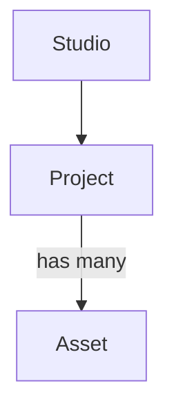

Papervine ships a styled set of MDX components, resolved at compile time, matching the
established `docs.json` component set so real repos render unchanged. This page describes each v1 component and what
it is for. Because these docs render in Papervine itself, several are demonstrated inline.

<Note>
  Unknown components never crash a page — they degrade to their children. This page covers
  the supported set; see [renderer internals](/rendering/internals) for how the fallback
  works.
</Note>

## Cards

`<Card>` is a linkable panel with an optional icon and title; `<CardGroup>` arranges cards in
a responsive grid (`cols`). Use them for navigation hubs and feature overviews. (`<Columns>`
is the current name for the grid; `<CardGroup>` is the legacy alias.)

`cols` is the count for a screen wide enough to hold it. On phone-width screens the grid is
always a **single column**, however many you asked for — two 150px-wide cards break headings
mid-word, so the column count applies from tablet width up.

<CardGroup cols={2}>
  <Card title="Linkable" icon="link">
    A card can wrap a link, turning the whole panel into a navigation target.
  </Card>
  <Card title="Grouped">
    `<CardGroup cols={2}>` lays cards out in a grid that reflows on small screens.
  </Card>
</CardGroup>

## Tabs

`<Tabs>` with `<Tab>` children renders tabbed content — switch between alternative views
without leaving the page. Common for showing the same task in different languages or
platforms.

<Tabs>
  <Tab title="npm">
    Install with `npm install`.
  </Tab>
  <Tab title="pnpm">
    Install with `pnpm add`.
  </Tab>
</Tabs>

## Steps

`<Steps>` with `<Step>` children renders a numbered walkthrough — sequential instructions
with automatic numbering and connecting rail. Use for setup guides and ordered procedures.

<Steps>
  <Step title="Connect a repo">
    Point Papervine at a Git repo of MDX + `docs.json`.
  </Step>
  <Step title="Sync">
    Papervine copies the repo into object storage.
  </Step>
  <Step title="Render">
    Your docs site is live.
  </Step>
</Steps>

## Callouts

Callouts highlight an aside with a colored panel and icon. Four variants ship in v1, each
signaling a different intent:

<Note>`<Note>` — a neutral aside; supplementary information.</Note>
<Info>`<Info>` — context or background worth knowing.</Info>
<Tip>`<Tip>` — a helpful suggestion or shortcut.</Tip>
<Warning>`<Warning>` — something that can bite you; read before proceeding.</Warning>

## CodeGroup

`<CodeGroup>` wraps several code blocks into a single tabbed widget — one tab per block,
labeled by the block's **title**, falling back to its language. Use it to present the same
snippet across languages or tools.

<Tip>
  Give every fence in a group a title. Without one they fall back to the language name, so three
  `bash` blocks in a group all read "shellscript".
</Tip>

<CodeGroup>
```bash Terminal
papervine dev ./docs
```

```js config.js
export default { theme: "mint" };
```
</CodeGroup>

## Code blocks

Individual code blocks get Shiki syntax highlighting in a dual light/dark theme, applied at
build time so a block follows the page's appearance with no client-side work.

**Every block has a copy button.** It appears on hover, stays visible on touch devices where
there is no hover, and copies the block's source without the highlighting.

**Text after the language becomes the block's title**, shown in a header bar above the code.
Both the bare form and an explicit `title="…"` work, and the title is what `<CodeGroup>` uses
for its tab labels:

````mdx
```ts lib/greet.ts
export function greet(name: string) {
  return `Hello, ${name}`;
}
```
````

<Note>
  Line-highlight ranges (```` ```js {2,4-6} ````) are parsed as "not a title" and otherwise
  ignored — the range renders no differently from a plain block. Titles and the copy button are
  the parts of code-block parity that are built.
</Note>

## Your own components

The set below is what ships with the renderer, but you are not limited to it — you can define a
component inside a page and use it immediately, with React hooks available and nothing to
import. See [React components](/rendering/react-components).

## Accordion

`<Accordion>` is a single collapsible disclosure; `<AccordionGroup>` stacks several so they
can share a section. Use them to hide secondary detail (FAQs, advanced options) until the
reader expands it.

<AccordionGroup>
  <Accordion title="What is collapsed by default?">
    Accordions start closed, keeping the page scannable until a reader opens one.
  </Accordion>
  <Accordion title="When to group">
    Use `<AccordionGroup>` for a related set, like a FAQ list.
  </Accordion>
</AccordionGroup>

## Frame

`<Frame>` wraps an image or embed in a bordered container with an optional caption. Use it to
present screenshots and diagrams consistently, with framing and centering handled for you.

## Video and embeds

There is **no video component** — video is plain HTML, and that is deliberate: it's what the
`docs.json` schema this renderer follows uses, so a page written this way moves between platforms
untouched. Both tags below are ordinary MDX, so they reach the page as real elements.

A video the site serves itself:

```mdx
<video controls className="w-full aspect-video rounded-xl" src="/videos/demo.mp4"></video>
```

Add `autoPlay muted loop playsInline` for a silent looping clip — browsers block autoplay with
sound, so `muted` is what makes it start. A `<source>` list works too, when you want to offer
more than one encoding:

```mdx
<video controls className="w-full aspect-video rounded-xl">
  <source src="/videos/demo.webm" type="video/webm" />
  <source src="/videos/demo.mp4" type="video/mp4" />
</video>
```

Anything hosted elsewhere — YouTube, Loom, Vimeo, a sandbox, another docs site — is an iframe:

```mdx
<iframe
  className="w-full aspect-video rounded-xl"
  src="https://www.youtube.com/embed/4KzFe50RQkQ"
  title="YouTube video player"
  allow="accelerometer; autoplay; clipboard-write; encrypted-media; gyroscope; picture-in-picture"
  allowFullScreen
></iframe>
```

<Note>
  Use the **embed** URL, not the one in your browser's address bar. A `youtube.com/watch?v=…` link
  won't play in a frame. Studio's `/embed` command does this conversion for you, and its `/video`
  command uploads a file and writes the `<video>` tag — see [Studio](/control-plane/editor).
</Note>

`aspect-video` gives a 16:9 box that scales with the page, which is what you want for almost every
video; `h-96` (or any height utility) suits a non-video embed that isn't 16:9. Wrapping either in
[`<Frame>`](#frame) adds a border and caption.

## Mermaid diagrams

A fenced code block tagged `mermaid` renders as a diagram, not as highlighted code:

````md

````

Which renders as:


The diagram is drawn in the browser and follows the page's light/dark appearance — toggle the
theme and it redraws to match. Node labels may use simple inline HTML (`<br/>`, `<i>`); scripts
are stripped. A diagram that fails to parse falls back to showing its source, so a typo never
breaks the page.

## The full set

Every name below resolves to a real component. Anything not listed degrades to its children.

| Component | For |
| --- | --- |
| `<Note>` `<Tip>` `<Info>` `<Warning>` `<Check>` `<Danger>` | Callouts, by severity |
| `<Callout icon color>` | A callout with your own icon and color |
| `<Banner type dismissible>` | A prominent announcement bar |
| `<Card>` `<CardGroup>` `<Columns>` | Linkable cards in a responsive grid |
| `<Tile>` | A card that leads with a preview image |
| `<Steps>` `<Step>` | Numbered instructions |
| `<Tabs>` `<Tab>` | Switchable views of the same idea |
| `<CodeGroup>` | Several code blocks as one tabbed panel |
| `<Accordion>` `<AccordionGroup>` | Progressive disclosure |
| `<Expandable>` | Nested detail, usually object shapes |
| `<Frame>` | A bordered, captioned container for an image |
| `<Badge>` | Inline status labels |
| `<Icon>` | An inline icon |
| `<Tooltip>` | A definition on hover or focus |
| `<Tree>` / `<FileTree>` with `<Tree.Folder>` `<Tree.File>`, or a Markdown list | File and folder structures |
| `<Color>` with `<Color.Item>` `<Color.Row>` | Color swatches, optionally per theme |
| `<Update>` | A changelog entry, with a linkable anchor |
| `<Prompt>` | A copyable AI prompt |
| `<GitHub.Repo>` | A repository card with live stars and forks |
| `<Visibility for>` | Content for humans or for AI agents |
| `<View>` | A labelled variant of the same content |
| `<ParamField>` `<ResponseField>` | API parameter and response definitions |
| `<RequestExample>` `<ResponseExample>` `<Panel>` | Supplementary panels |
| ` ```mermaid ` | Diagrams |

### Where fidelity differs

Three components render correctly but not identically to other `docs.json` platforms. The
differences are deliberate, and in each case the content stays complete and readable.

<AccordionGroup>
  <Accordion title="Icon resolves Lucide names only">
    Some platforms resolve icon names against Font Awesome, Lucide and Tabler. Papervine
    carries Lucide. A name it doesn't have renders nothing rather than breaking the line, and
    `<Icon src="/path/to/icon.svg" />` accepts any file or URL — which is the escape hatch for
    an icon we can't resolve by name.
  </Accordion>
  <Accordion title="View renders every variant instead of a dropdown">
    Elsewhere, sibling `<View>` blocks collapse into one dropdown that also filters the table
    of contents. That requires processing the page as a whole, because the views are siblings
    rather than children of a wrapper. Here each renders as a labelled section, so nothing is
    hidden and every variant stays searchable and linkable.
  </Accordion>
  <Accordion title="Panels render inline rather than in the sidebar">
    `<Panel>`, `<RequestExample>` and `<ResponseExample>` are designed to move into the right
    column, replacing the table of contents. Papervine renders them in place, styled as
    distinct panels. For a request/response pair the practical difference is that examples sit
    below the prose instead of beside it; the content, highlighting and copy buttons are
    unaffected.
  </Accordion>
</AccordionGroup>

### File trees, two ways

`<Tree>` (also `<FileTree>`) takes explicit elements:

```mdx
<Tree>
  <Tree.Folder name="app" defaultOpen>
    <Tree.File name="page.tsx" highlight />
  </Tree.Folder>
</Tree>
```

Or a Markdown list, which is usually less typing:

```mdx
<FileTree>

- docs/
  - index.mdx
  - guides/
    - configuration.mdx
- docs.json

</FileTree>
```

A trailing slash marks a folder; so does having nested items, since a directory with children
is a directory either way. Folders with children open by default. Both forms produce the same
elements and can be mixed in one tree.

### Banners, two ways

`<Banner>` works inline, for a notice on one page. For a notice on *every* page, set `banner`
in [`docs.json`](/rendering/config) and it renders above the navbar site-wide:

```json
"banner": {
  "content": "Version 2.0 is live. See the [changelog](/changelog).",
  "type": "info",
  "dismissible": true
}
```

Both render the same component. `type` is `info`, `warning`, or `critical`; `color` accepts a
hex override. Dismissal isn't persisted between page loads — there's no stable identity to
key it to, and a banner that never returns after one click is worse than one that does.

## Related

- [Renderer internals](/rendering/internals) — how components resolve and how unknown ones
  fall back.
- [Config](/rendering/config) — themes and brand colors that style these components.
