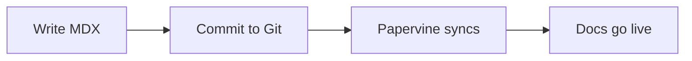

A fenced `mermaid` block renders as a diagram and follows the page's light/dark appearance.


```mermaid
graph LR
  Write["Write MDX"] --> Commit["Commit to Git"]
  Commit --> Sync["Papervine syncs"]
  Sync --> Live["Docs go live"]
```

````mdx

```mermaid
graph LR
  Write["Write MDX"] --> Commit["Commit to Git"]
  Commit --> Sync["Papervine syncs"]
  Sync --> Live["Docs go live"]
```
````
