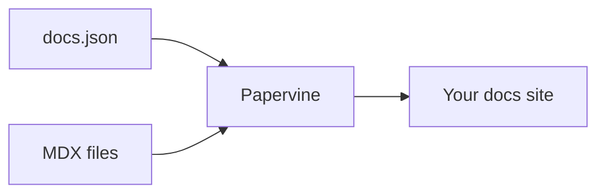

Everything below works in any `.mdx` page with no imports.

## Callouts

<Note>Useful context that isn't essential.</Note>
<Tip>A recommendation or shortcut.</Tip>
<Warning>Something that could bite.</Warning>
<Info>Neutral background information.</Info>

## Cards

<CardGroup cols={2}>
  <Card title="With a link" href="/quickstart">
    Cards take an optional `href` and become clickable.
  </Card>
  <Card title="Without one">
    Plain cards work too, for grouping related notes.
  </Card>
</CardGroup>

## Steps

<Steps>
  <Step title="First">Numbered, ordered instructions.</Step>
  <Step title="Second">Each step can hold any content, including code.</Step>
</Steps>

## Tabs

<Tabs>
  <Tab title="macOS">
    ```bash
    brew install node
    ```
  </Tab>
  <Tab title="Linux">
    ```bash
    sudo apt install nodejs
    ```
  </Tab>
</Tabs>

## Code

Fenced blocks are syntax highlighted, with light and dark themes:

```ts
export function greet(name: string) {
  return `Hello, ${name}`;
}
```

A `CodeGroup` turns several blocks into one tabbed panel — the tab label comes from the
text after the language:

<CodeGroup>

```bash npm
npm i papervine
```

```bash pnpm
pnpm add papervine
```

</CodeGroup>

## Accordions

<AccordionGroup>
  <Accordion title="Collapsed by default">
    Good for FAQs and detail that would otherwise crowd the page.
  </Accordion>
  <Accordion title="Another one">
    Accordions can contain any content.
  </Accordion>
</AccordionGroup>

## Expandable fields

<Expandable title="Nested properties">
  Useful for documenting object shapes.
</Expandable>

## Frames

Wrap an image to give it a caption and a border:

<Frame caption="A framed image">
  
</Frame>

## Diagrams

Fenced `mermaid` blocks render as diagrams:



<Note>
  An unrecognized component degrades to its children rather than breaking the page, so an
  unsupported feature never takes a page down.
</Note>
