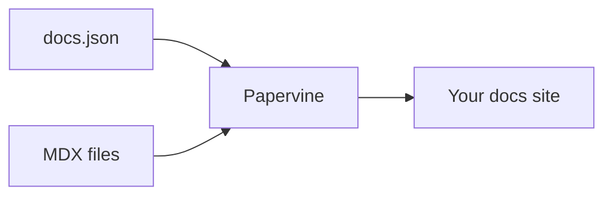

Components work in any `.mdx` page with no imports. This page shows a handful to prove the
renderer is working; it is deliberately not the full reference.

<Note>
  The complete gallery — all 26 component groups with copyable examples — lives in the
  [starter repo](https://github.com/papervine/starter). Keeping one showcase means it can't
  drift out of date against another.
</Note>

## Callouts

<Note>Useful context that isn't essential.</Note>
<Warning>Something that could bite.</Warning>

## Cards

<CardGroup cols={2}>
  <Card title="Quickstart" href="/quickstart" icon="rocket">
    Get a docs site running in about a minute.
  </Card>
  <Card title="Full component gallery" href="https://github.com/papervine/starter" icon="book-open">
    Every component, with examples you can copy.
  </Card>
</CardGroup>

## Steps

<Steps>
  <Step title="Edit docs.json">Set your site name, colors, and navigation.</Step>
  <Step title="Write pages">Add `.mdx` files and reference them from the navigation.</Step>
  <Step title="Preview">Run `papervine dev` and refresh as you save.</Step>
</Steps>

## Code

<CodeGroup>

```bash npm
npm i -g papervine
```

```bash npx
npx papervine@latest dev
```

</CodeGroup>

## Images

<Frame caption="A framed image">
  
</Frame>

## Diagrams



<Note>
  An unrecognized component degrades to its children rather than breaking the page, so an
  unsupported feature never takes a page down.
</Note>
