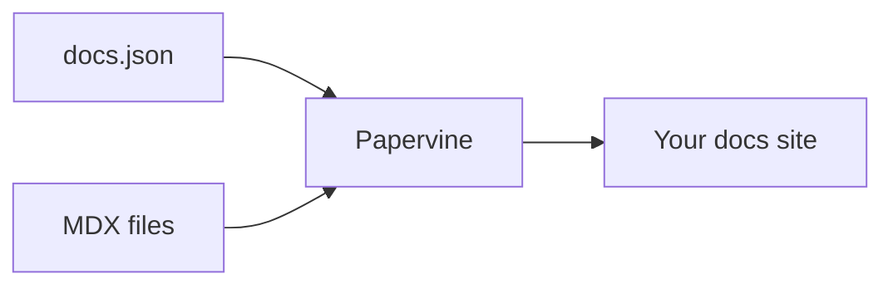

Everything below works in any `.mdx` page with no imports. An unrecognized component
degrades to its children rather than breaking the page, so an unsupported feature never
takes a page down.

## Callouts

<Note>Useful context that isn't essential.</Note>
<Tip>A recommendation or shortcut.</Tip>
<Info>Neutral background information.</Info>
<Warning>Something that could bite.</Warning>
<Check>A confirmation or completed step.</Check>
<Danger>A destructive or irreversible action.</Danger>

Or bring your own icon and color:

<Callout icon="rocket" color="#7C3AED">
  A custom callout, with any Lucide icon name and any CSS color.
</Callout>

## Badges

Inline labels and status. <Badge color="green">Stable</Badge> <Badge color="yellow">Beta</Badge> <Badge color="red">Deprecated</Badge>

<Badge icon="star" color="blue" size="lg" shape="pill">Premium</Badge>
<Badge color="gray" stroke>Outlined</Badge>

## Icons

Icons come from [Lucide](https://lucide.dev): <Icon icon="flag" size={20} /> <Icon icon="rocket" size={20} /> <Icon icon="database" size={20} color="#7C3AED" />

<Note>
  Upstream `docs.json` projects may reference Font Awesome or Tabler names. Those render
  nothing rather than breaking the line — use a Lucide name, or point `src` at your own file:
  <Icon src="/images/example.svg" size={20} />
</Note>

## Tooltips

Hover or focus a term for a definition: <Tooltip headline="MDX" tip="Markdown with JSX components mixed in — the format these pages are written in." cta="See the quickstart" href="/quickstart">MDX</Tooltip>.

## Cards and tiles

<CardGroup cols={2}>
  <Card title="With a link" href="/quickstart">
    Cards take an optional `href` and become clickable.
  </Card>
  <Card title="Without one">
    Plain cards work too, for grouping related notes.
  </Card>
</CardGroup>

Tiles lead with a preview image, and pair with `<Columns>` for a grid:

<Columns cols={2}>
  <Tile href="/quickstart" title="Get started" description="Install and preview in a minute">
    
  </Tile>
  <Tile title="No link" description="Tiles work without an href too">
    
  </Tile>
</Columns>

## Steps

<Steps>
  <Step title="First">Numbered, ordered instructions.</Step>
  <Step title="Second">Each step can hold any content, including code.</Step>
</Steps>

## Tabs

<Tabs>
  <Tab title="macOS">
    ```bash
    brew install node
    ```
  </Tab>
  <Tab title="Linux">
    ```bash
    sudo apt install nodejs
    ```
  </Tab>
</Tabs>

## Code

Fenced blocks are syntax highlighted, with light and dark themes:

```ts
export function greet(name: string) {
  return `Hello, ${name}`;
}
```

A `CodeGroup` turns several blocks into one tabbed panel — the tab label comes from the
text after the language:

<CodeGroup>

```bash npm
npm i papervine
```

```bash pnpm
pnpm add papervine
```

</CodeGroup>

## Accordions and expandables

<AccordionGroup>
  <Accordion title="Collapsed by default">
    Good for FAQs and detail that would otherwise crowd the page.
  </Accordion>
  <Accordion title="Another one">
    Accordions can contain any content.
  </Accordion>
</AccordionGroup>

<Expandable title="Nested properties">
  Useful for documenting object shapes.
</Expandable>

## File trees

<Tree>
  <Tree.Folder name="app" defaultOpen>
    <Tree.File name="layout.tsx" />
    <Tree.File name="page.tsx" highlight />
  </Tree.Folder>
  <Tree.Folder name="lib">
    <Tree.File name="utils.ts" />
  </Tree.Folder>
  <Tree.File name="docs.json" />
</Tree>

Also available as `<FileTree>`.

## Colors

<Color variant="compact">
  <Color.Item name="primary" value="#7C3AED" />
  <Color.Item name="light" value="#A78BFA" />
  <Color.Item name="themed" value={{ light: "#18181B", dark: "#FAFAFA" }} />
</Color>

## Frames

Wrap an image to give it a caption and a border:

<Frame caption="A framed image">
  
</Frame>

## Diagrams

Fenced `mermaid` blocks render as diagrams:



## API reference

<ParamField path="limit" type="integer" default="20">
  How many records to return.
</ParamField>

<ResponseField name="id" type="string" required>
  The record's unique identifier.
</ResponseField>

<RequestExample>

```bash cURL
curl https://api.example.com/v1/records \
  -H "Authorization: Bearer $TOKEN"
```

</RequestExample>

<ResponseExample>

```json 200
{ "id": "rec_123", "name": "Example" }
```

</ResponseExample>

## Changelog entries

<Update label="2026-08-23" description="v0.1.0" tags={["release"]}>
  Each entry's label is an anchor, so a specific release is linkable.
</Update>

## AI prompts

<Prompt description="Ask an assistant to draft a page in this project's voice." icon="sparkles" actions={["copy", "cursor"]}>
Write a new docs page describing the feature I just built. Match the tone of the existing pages, keep it task-focused, and use the components from /components where they help.
</Prompt>

## Repository cards

<GitHub.Repo repo="papervine/cli" />

## Audience-specific content

<Visibility for="humans">
  <Note>You're reading the rendered site.</Note>
</Visibility>

<Visibility for="agents">
This block is written for AI agents reading the Markdown and is omitted from the page.
</Visibility>

## Variants

<View title="JavaScript" icon="code">
  ```js
  console.log("Hello");
  ```
</View>

<View title="Python" icon="terminal">
  ```python
  print("Hello")
  ```
</View>

<Note>
  Upstream, sibling `<View>` blocks collapse into a single dropdown. Here each renders as a
  labelled section — nothing is hidden, so every variant stays readable and linkable.
</Note>

## Sidebar panels

<Panel>
  <Info>Panel content renders inline, in document order.</Info>
</Panel>
